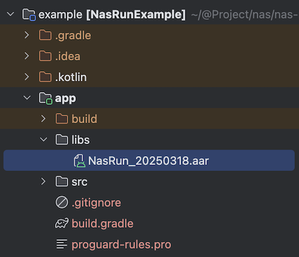
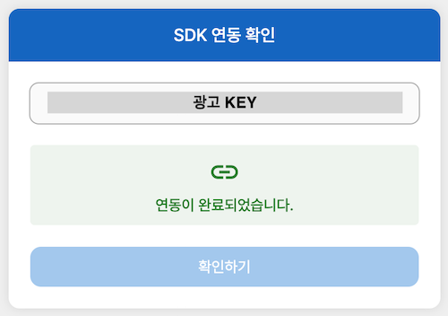

# NasRun Android 연동 가이드

## 목차
- [1. 개요](#1-개요)
- [2. 설치](#2-설치)
  - [2-1. SDK 파일 추가](#2-1-sdk-파일-추가)
  - [2-2. 의존성 추가](#2-2-의존성-추가)
  - [2-3. 권한 추가](#2-3-권한-추가)
  - [2-4. Proguard 예외 처리](#2-4-Proguard-예외-처리)
- [3. SDK 사용](#3-sdk-사용)
  - [3-1. SDK 호출](#3-1-sdk-호출)
  - [3-2. 호출 시점](#3-2-호출-시점)
- [4. 연동 확인](#4-연동-확인)
- [5. 예제 프로그램](#5-예제-프로그램)
- [🔗⠀다른 플렛폼 SDK](#-다른-플렛폼-sdk)

## 1. 개요
`NasRun SDK`는 안드로이드 앱의 실행형/미션형 광고를 진행하기 위한 SDK 입니다.

## 2. 설치

### 2-1. SDK 파일 추가
`/sdk` 폴더에 있는 `NasRun_xxxxxxxx.aar` 파일을 프로젝트의 `/app/libs` 폴더에 추가합니다.



### 2-2. 의존성 추가

`/app/build.gradle`파일의 `dependencies`에 다음 의존성을 추가합니다.

```
implementation fileTree(dir: 'libs', include: ['*.aar', '*.jar'], exclude: [])
```

### 2-3. 권한 추가
`AndroidManifest.xml` 에서 다음 권한을 추가합니다.

```xml
<uses-permission android:name="android.permission.INTERNET"/>
<uses-permission android:name="com.google.android.gms.permission.AD_ID" />
```

### 2-4. Proguard 예외 처리

프로젝트에 Proguard 를 적용한다면, `/app/proguard-rules.pro` 파일에 다음 예외 처리를 추가합니다.

```
# NasRun SDK Proguard
-dontwarn kr.mafin.nasrunlibrary.**
-keep class kr.mafin.nasrunlibrary.** {
    *;
}
```

## 3. SDK 사용

### 3-1. SDK 호출
```kotlin
import kr.mafin.nasrunlibrary.NasRun

NasRun.run(this, "32자리 광고 KEY")
```

### 3-2. 호출 시점

#### 실행형 광고
- 앱의 실행 시점에 호출합니다.

#### 미션형 광고
- 로그인, 레벨 달성등의 미션형 광고일 경우, 해당 미션의 **완료 시점**에 호출합니다.
- 미션 완료 이후에는 앱 **실행 시점**에 미션 완료 여부를 확인하여 다시 호출해야합니다.
- 미션 완료 시점에만 1회 호출하면, 인터넷 연결 문제등으로 참여가 정상적으로 완료되지 않을 수 있습니다.

## 4. 연동 확인

SDK 호출 후 [연동 확인 홈페이지](https://ow.appang.kr/sdk/connected)에 접속하여 광고 KEY를 입력하면 연동 결과를 확인할 수 있습니다.

> 연동이 완료된 경우, 미연동 상태로 변경할 수 있는 기능을 제공합니다.
>
> SDK 호출로 서버와 통신이 완료되면, 다시 SDK를 호출해도 서버와 통신이 이루어지지 않습니다. 앱 삭제 후 재설치하여 SDK를 호출해야 정상적으로 연동됩니다.



## 5. 예제 프로그램
예제 프로그램은 `/example` 폴더에 있습니다.

- [Kotlin 예제](example)

## 🔗 다른 플렛폼 SDK
- [`iOS SDK`](https://github.com/mafin-global/nas-run-ios)
